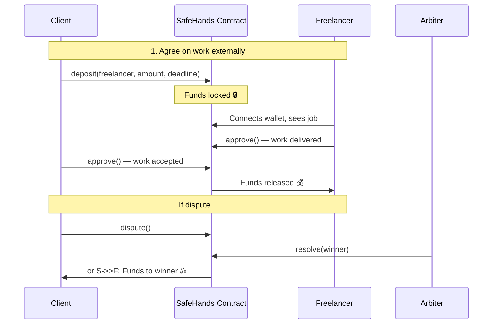

# SafeHands — Trustless Escrow Payments on Stellar

**SafeHands** is a decentralized escrow payment platform built on the **Stellar Network** using **Soroban Smart Contracts**. It provides a secure way for clients and freelancers to handle payments — eliminating the need for trust between parties.

> **This is NOT a job marketplace.** SafeHands assumes both parties have already agreed on the work externally (via email, chat, in person, etc.). The platform only handles the **secure payment flow**.

## 💡 How It Works

```
1. Client & Freelancer agree on a job externally (WhatsApp, email, etc.)
2. Client → Opens SafeHands → Enters freelancer's Stellar wallet address → Locks payment
3. Freelancer → Connects wallet → Sees the job details, amount, and deadline
4. Work gets done → Both parties click "Approve" → Funds are released to freelancer
5. Problem? → Either party raises a Dispute → Arbiter resolves it
```

### User Flow Diagram



## 🚀 Features

- **Secure Deposits** — Client locks XLM into a smart contract. No one can touch it until approval.
- **Mutual Approval** — Funds released only when both Client and Freelancer approve.
- **Cancel & Refund** — Client can cancel before freelancer accepts (full refund).
- **Dispute Resolution** — Either party can dispute. A designated Arbiter resolves it.
- **Deadline / Timeout** — Auto-refund to client if the job isn't completed by the deadline.
- **Job Details** — Title, description, and category stored locally for context.
- **Toast Notifications** — Real-time feedback for all actions (no more alert popups).
- **Transaction Polling** — Confirms transactions on-chain with progress indicators.
- **XLM Display** — Amounts shown in human-readable XLM (not raw stroops).
- **Responsive Design** — Works on mobile and desktop.
- **Step-by-Step Guidance** — Each user sees contextual instructions based on their role and the current state.

## 🛠 Tech Stack

| Layer | Technology |
|:------|:-----------|
| Smart Contract | Rust, Soroban SDK v21 |
| Frontend | Next.js 16, TypeScript, Tailwind CSS v4 |
| Wallet | Freighter Browser Extension |
| Network | Stellar Testnet |
| Notifications | react-hot-toast |

## 📂 Project Structure

```
.
├── contracts/                  # Soroban Smart Contract (Rust)
│   ├── src/
│   │   ├── lib.rs              # Contract logic (8 public functions)
│   │   └── test.rs             # Unit tests (10 tests)
│   └── Cargo.toml
├── frontend/                   # Next.js Application
│   ├── app/
│   │   ├── page.tsx            # Dashboard (create + list escrows)
│   │   └── escrow/[id]/page.tsx # Escrow detail page
│   ├── components/
│   │   ├── CreateEscrowForm.tsx # Job creation form
│   │   ├── EscrowCard.tsx       # Job card with actions + guidance
│   │   ├── EscrowList.tsx       # Filterable job list
│   │   └── FreighterConnect.tsx # Wallet connection
│   └── utils/
│       ├── soroban.ts          # Contract interaction (deposit, approve, etc.)
│       ├── format.ts           # XLM ↔ stroops conversion
│       └── jobStore.ts         # Job metadata (localStorage)
├── docs/                       # Documentation
├── deploy_contract.ps1         # Deployment script (Windows)
└── contract_id.txt             # Current deployed contract ID
```

## ⚡ Getting Started

### Prerequisites

1. **Rust & Stellar CLI** — Install from [rustup.rs](https://rustup.rs) + `cargo install --locked stellar-cli`
2. **Node.js** — Version 18+
3. **Freighter Wallet** — [Install extension](https://freighter.app) and switch to **Testnet**

### 1. Build & Test the Smart Contract

```bash
cd contracts
cargo test
```

Build the WASM:
```bash
cargo build --target wasm32-unknown-unknown --release
```

### 2. Deploy the Contract

```powershell
.\deploy_contract.ps1
```

Or manually:
```bash
stellar contract deploy \
  --wasm target/wasm32-unknown-unknown/release/safe_hands_contract.wasm \
  --source deployer --network testnet
```

Then update `CONTRACT_ID` in `frontend/utils/soroban.ts` with the new address.

**Current Contract**: `CDYN4KMSDSTAFIEMXKVNWDT2DK3JGVHC242NWOPVPBFMCXA2OX5LI52K`

### 3. Run the Frontend

```bash
cd frontend
npm install
npm run dev
```

Open [http://localhost:3000](http://localhost:3000)

## � Usage

### Connecting Your Wallet

1. Install the [Freighter Wallet](https://freighter.app) browser extension.
2. Create or import a Stellar account.
3. Switch to **Testnet** in Freighter settings (Settings → Network → Testnet).
4. Fund your account at [Stellar Friendbot](https://friendbot.stellar.org?addr=YOUR_ADDRESS).
5. Click **"Connect Wallet"** on the SafeHands dashboard — approve the connection in Freighter.

### Creating an Escrow (Client)

1. Fill in the **Job Title**, **Category**, and **Description** to document what the work is about.
2. Paste the **Freelancer's Stellar Address** (`G...`) — you must agree on this address beforehand.
3. Optionally set an **Arbiter Address** for dispute resolution (defaults to yourself).
4. Enter the **Amount in XLM** and set a **Deadline** (in days).
5. Click **"Lock Funds & Create Job"** → approve the transaction in Freighter.

### Approving & Releasing Funds

1. **Freelancer** connects their wallet → sees the escrow under "Your Escrows".
2. Once work is complete, **Freelancer clicks "Approve Release"** → signs in Freighter.
3. **Client reviews** the work → clicks **"Approve Release"** → signs in Freighter.
4. When **both** have approved, funds are **automatically released** to the freelancer.

### Cancelling, Disputing & Timeout

- **Cancel**: Client can cancel and get a full refund *before* the freelancer approves.
- **Dispute**: Either party can raise a dispute → the Arbiter resolves it by awarding funds.
- **Timeout**: If the deadline passes, anyone can trigger **"Claim Timeout Refund"** to refund the client.

## �📜 Smart Contract

The contract implements a **Finite State Machine** for escrow management:

### States

| State | Description |
|:------|:------------|
| `Funded` | Funds are locked in the contract. Awaiting work + approvals. |
| `Released` | Both parties approved. Funds transferred to freelancer. ✅ |
| `Cancelled` | Client cancelled or deadline expired. Funds refunded. |
| `Disputed` | A party raised a dispute. Awaiting arbiter decision. ⚖️ |
| `Resolved` | Arbiter resolved the dispute. Funds awarded to winner. |

### Functions

| Function | Description |
|:---------|:------------|
| `deposit(client, freelancer, arbiter, token, amount, deadline_days)` | Lock funds. Returns escrow ID. |
| `approve(approver, escrow_id)` | Approve release. Auto-releases when both approve. |
| `cancel(caller, escrow_id)` | Client-only refund (before freelancer approval). |
| `dispute(caller, escrow_id)` | Either party raises a dispute. |
| `resolve(arbiter, escrow_id, winner)` | Arbiter awards funds to winner. |
| `claim_timeout(escrow_id)` | Anyone can trigger refund after deadline. |
| `get_escrow(escrow_id)` | Read escrow details. |
| `get_user_escrows(user)` | List escrow IDs for a user. |

## 🧪 Tests

10 unit tests covering:

- ✅ Happy path: Deposit → Approve → Release
- ✅ Cancel flow: Deposit → Cancel → Refund
- ✅ Dispute flow: Deposit → Dispute → Arbiter Resolve
- ✅ Deadline: Deposit → Time passes → Claim Timeout → Refund
- ✅ Edge cases: Zero amount, zero deadline, double approval, unauthorized cancel, unauthorized resolve, premature timeout

```bash
cd contracts && cargo test
```

## 🎨 Design

The UI follows a **Neo-Brutalist** design system — bold borders, high contrast, and chunky shadows for maximum clarity. See [Design System](docs/design/design-system.md) for details.

## ⚠️ Disclaimer

This project is for **educational purposes** on the Stellar Testnet. Do not use with real funds on Mainnet without a professional security audit.
